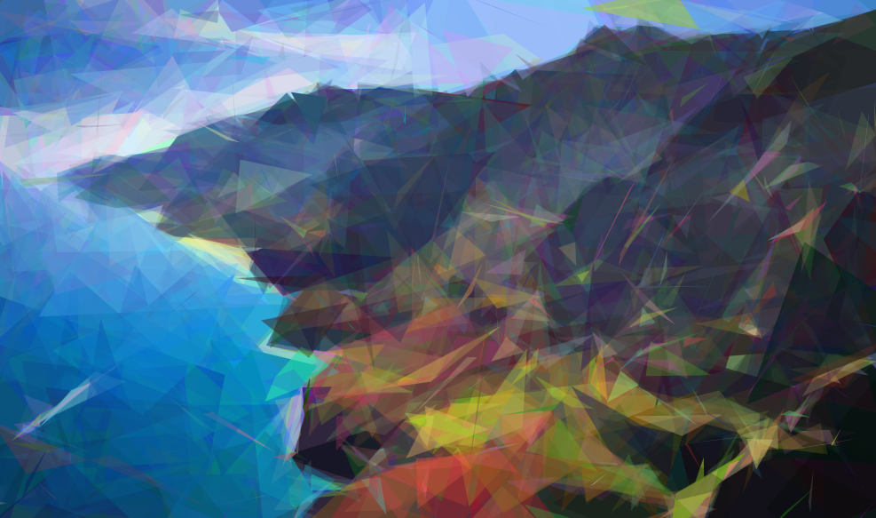
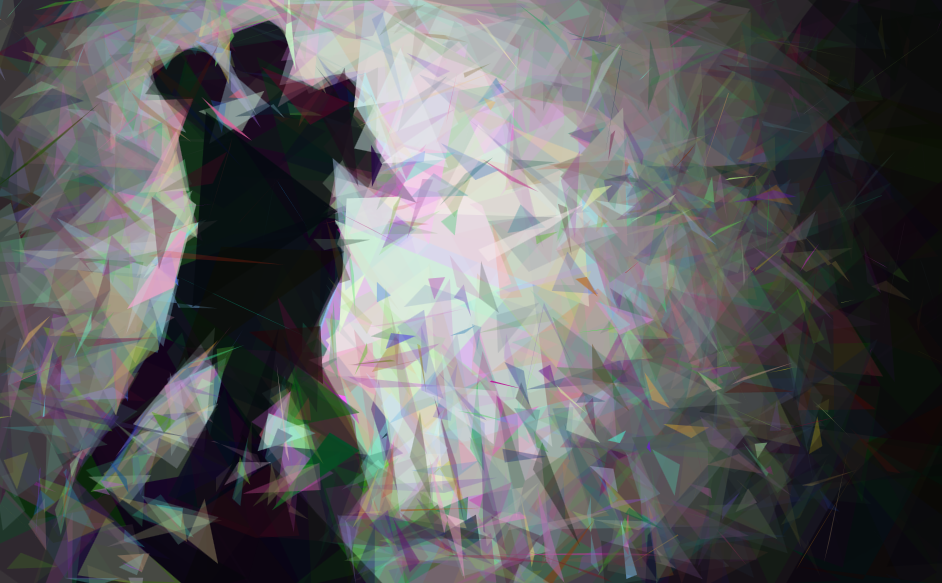

# VisualGeneticAlgorithms
Genetic algorithms in Javascript

Using simple polygons in the Javascript canvas to approximate images. The algorithm attempts to minimize the least squared error against the pixels of the image.
Results:

